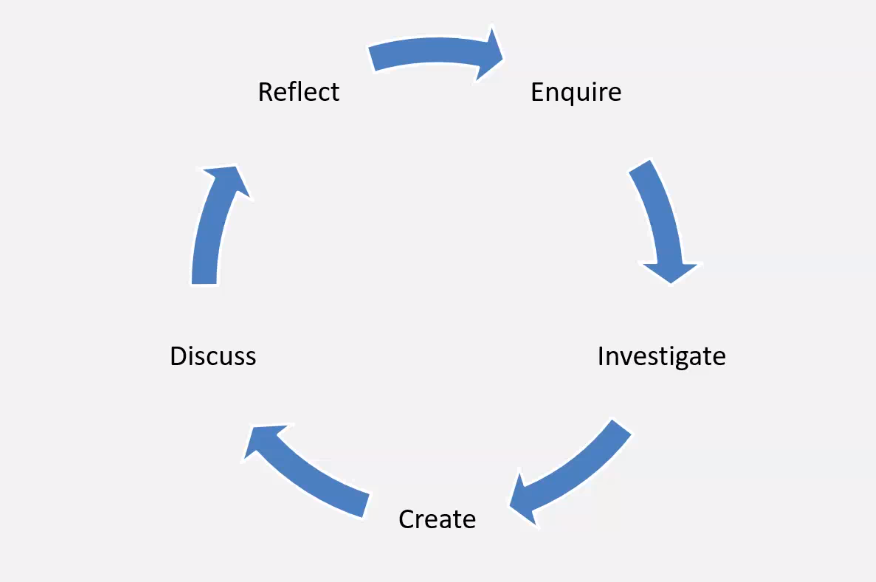
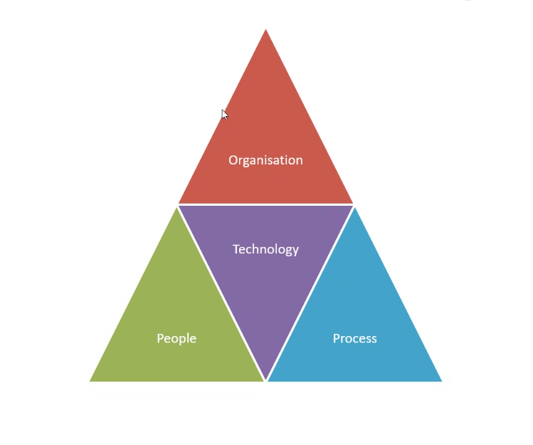
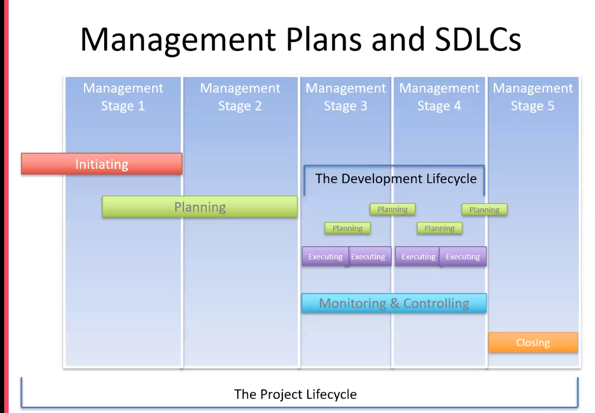

## Morning
 - Recap on Day 1 and 2

## After first break

### Critical Thinking 

#### Why is it important
- helps to create strong arguments with evidence to support it
- can contribute to multiple roles, helps to analyse your enviroment

#### Criticasl thinking Skills

- actively seeking out all sides of an argument 
- checking the facts and evidemce
- responding objectively

#### Thinking Triangle 

#### 3 Steps:
- Identify: The main process, the claims being made, the evidence used, the conclusions reached
- Analyse: Deos the info make sense?, How old is the material?, is the material clear and strict?, Does the argument present a balanced view or are some topics benig disregarded?
-  To Apply and Compare, look out for: The implications of other information, Weaknesses when applied to a real life situation, A lack of coverage.

#### 3 Modes of thinking:
- Divergent: Question -> Idea
- Convergent : Fact -> Answer
- Lateral : Uses Both 

- Example: Netflix lost database because they had all data on print: local host -> caused them to migrate all data to the cloud. 

#### 6 Thinking hats:
 - Parrallel thinking process to target different situations and provide the best thikninng process for each

#### Incorrect Attitudes:
- Ignorant Certainty: The belief that there are definite answerrs to all questions 
- Naive Relativism: The belief that there is no truth and all arguments are equal

#### What is Enquiry-Based Learning:
- Enquire about the situation to leanr more from it and then come to an educated conclusion.
- Use open questions to find out more about the situation. 

#### The Enquiry Cycle:

##### Thing to consider:
- What is the source of evidence?
- What are the kind of claims being made?
- Where is the evidence for these claims?
- Understand the story and the background
- Dont make instant assumptions.

#### Arguments:
- Explain a theory or viepoint that one may have

##### Bassic Argument Structure:
- Claim : present your agrument in a aclear statment
- Evidence: Present evidence to support your claim
- Impact - Explain the significance of the evidence i.e. how does it support your claim?

##### Evaluating an argument:
- To form a ajudgment on the validity of another patrys argument you must look at the following:
 - Coherence: Do the claims make logical sense?, Are the claims based on opinon or supoprted with evidemce?, Are there any assumptions made?, Have all alternatives been considered?
 - Supporting Evidence: Does the evidence support all the claims?, is the evidence appropriate for the topic?, is the evidence recnent?

##### Debating ettiquette:
- Listening and aknowlegde the pther persons view before challeneging it.
- Be constructive rather than simply dismissing the other person's point of view.
- Reflect on the strengths of the other person's argument
- think about your language - keep it formal and professional. so nobdy get offended. 

##### DOS AND DONTS:
- DONT: I, I thik nthat, personally
- DO: Statistics show:

##### Logical fallacies to look for:
- False dichotomy = where the speaker forces the debate into two sides, though there are more options avaibale. only offer thier subjective options not taking others into consideration.
- Assertion: When the speaker presents a statment as a fact which appears invalid or may be an assumption.
- Morally flawed - argumnent which go agiant the code of ethics and morals
- failure to deliver promises
- straw man : the speajker may intentiaonally inroduce an argument agianst them and rebut strengthern their position.
- Contradiction: reduces credibility
- Compare he conclusion to reality

#### The Are of persuasion:
- Persuasion: convinsing someone 

##### The Three pillars of Rhetoric:
- Ethos: Appealing thorugh authority or credibility
- Pathos: Applealing through emotional empathy
- Logos: Appealing through logic and reasoning

##### Important skills for debating:
- Keep points relevant
- Do: be prepared, stay calm, speak clearly and confidentaly, keep your language simple, active listening 
- Don't : Falsify or alter evidence, publicly diagree with the decision, Attack a speaker rather than the motion, Act aggressively, iterrupt others, disagree with facts or obvious truths.
- Rememeber your mistakes and learn from them. 
- Don't raise your voice. 

## After Lunch:

### Project Environment:

#### Project vs BAU:
- BAU - following standard day to day protocols of a company and sticking to them
- Project - specific situation that will differ from the everyday protocols and has a desired outcome

##### How to deal with project:
- Initiation --> Plannihng --> Execute --> Monitor --> Closing - Cylce of a project. 

#### The Triple Constriant:
- Time -- Quality -- Cost

#### The POPIT model:
- The Holistic Triangle:

### Software Development Life Cycles:
- Watefall
- Agile
- V-Model

#### WaterFall:
- in a sequence- beggining to end without going back between stages 
- dont test until end 

#### V- Model
- Verify all of he specificatiosn first then start codeing 
- after coding do  all testing like unit testing, integraton testing, system testing, acceptance testing 

#### Agile
- Iterative
- Plan -> Do -> Check 

#### Scrum
- BAcklog ->> Sprint Planning ->> Sprint BAcklog ->> 1 Scrum Team ->> Sprint Review ->> Increment ->> Sprint Restrospective 
- NOT A METHODOLOGY
- Used to manage tassk 
- has a Scrum Master 

#### Managment plans and SDLCs

#### Attributes of Mature teams
- Co-located
- Corss Functional Roles
- Solf-Oranisation
- Accountable and Empowered
- Test and Learn Feedback Loops
- Load os different organised departments 

#### Business Cases:
- Justification needs to shown why a business case needs tobe constructed
- A lot of different departments need to go into making a business cases
- Expected Benefits, Execution Timeline, Executive Summary, Investment Appraisal, Solutions/Options, Majo Risks, Stakeholders/Communication Plan

#### Techniques for Analysis:
- MOST
- Boston Box
- Porters Five Forces
- PESTLE 
- SWOT
- Workshops
- Interviews

#### StakeHolders
- Anyone who has an interest in your company/ business
- Return of Investment - the amount of profit you are expected to recieve back.
- Customers, Emploees, Suppliers

##### StakeHolder Attitudes:
- Champion
- Supporter 
- Neutral 
- Critic
- Opponent
- Blocker 

#### ROI
- comes down to the worth of the product to the people who need it 

#### DEALING WITH RISK:
- Avoidance
- Transfer 
- Reduce 
- Accpet 
- Exploit
- Share
- Enchance 
- Ignore

## Scrum Artifacts

### Product Backlog
- The Product Backlog is an ordered list of everything that is known to be needed in a product. It is constantly evolving and is never complete.

### Sprint Backlog
- The Sprint Backlog is a list of everything that the team commits to achieve in a given Sprint. Once created, no one can add to the Sprint Backlog except the Development Team. 
- If the Development Team needs to drop an item from the Sprint Backlog, they must negotiate it with the Product Owner. During this negotiation, the ScrumMaster should work with the Development Team and Product Owner to try to find ways to create some smaller increment of an item rather than drop it altogether.

### Increment
- At the end of every Sprint, the team must complete a product increment that is potentially releasable, meaning that meets their agreed-upon definition of done. (An example might be fully tested and fully approved.)
